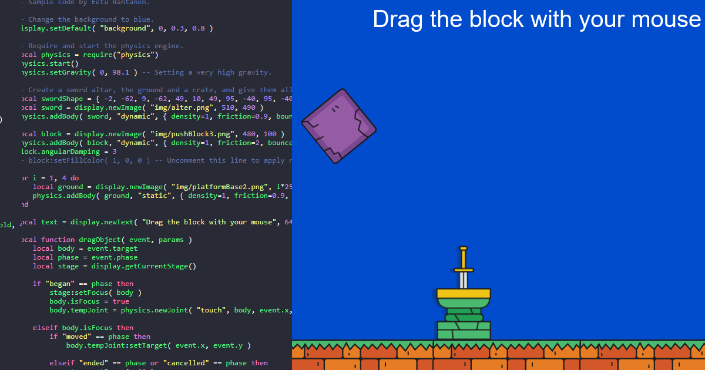

# Solar2D Playground

A browser-based code editor and runtime for [Solar2D](https://solar2d.com/). Write Lua code, hit run, and see it execute instantly in an embedded Solar2D HTML5 build. No installation required.

**[Try it online](https://playground.solar2d.com/)**



## What Is This?

Solar2D Playground lets you experiment with Solar2D directly in the browser. It includes a set of sample projects that demonstrate various Solar2D features, and five custom project slots where you can write, edit, and test your own code. Projects can be uploaded and downloaded as `.lua` files.

The embedded Solar2D app has access to a collection of built-in images, sounds, and fonts. Because the Playground runs on a static hosting environment (GitHub Pages), you are limited to these bundled assets.

If you want to build games and apps without limitations, [download Solar2D](https://solar2d.com/).

## Features

- **Code editor** with Lua syntax highlighting (CodeMirror with Dracula theme)
- **Sample projects** loaded from the server, showcasing different Solar2D features
- **Custom project slots** for writing and testing your own code
- **Upload and download** projects as `.lua` files
- **Keyboard shortcuts**: Ctrl+Shift+R to run/restart, Ctrl+Shift+S to download

## Planned features

- External asset uploads (not limited to bundled assets)
- Shareable project URLs via dynamic slugs and Cloudflare integration
- Google Drive integration for saving and loading projects
- Improved debugging tools for catching coding errors
- Full screen mode

## How to Contribute

Contributions are welcome. If you have sample projects you'd like to add, fixes to suggest, or improvements to make, feel free to open a pull request or reach out via [Solar2D's Discord](https://discord.gg/QTD4g4w).

### Running locally

Serve the project folder with any static HTTP server (e.g. XAMPP, Apache, Nginx). Then open `http://localhost/www.solar2dplayground.com/` in your browser.

If the Solar2D app fails to load (black screen, font loading errors in the console), make sure you are using `http://` and not `https://`. Firefox's OpenType Sanitizer rejects fonts loaded from blob URLs when the page is served over HTTPS with a self-signed certificate, which prevents the app from starting.

### Adding or updating sample projects

Sample projects live in `demos/` as individual `.lua` files. The order they appear in the Playground is controlled by `demos/demo-order.json`. After adding or modifying demos, rebuild `demos/demos.json`:

```bash
python demos/build_demos.py
```

### Building the Solar2D app

The Solar2D source lives in `solar2d/src/`. Build it as an HTML5 project using Solar2D Simulator with the following settings:

- **Application Name**: `playground` (the built-in `index.html` expects `playground.bin` and `playground.data`)
- **Version Code**: any value
- **Include Standard Resources**: off
- **Create FB Instant Archive**: off

After building, copy only the `.bin` and `.data` files into `solar2d/bin/`. Do not copy any HTML files produced by the build. The project uses a customised `index.html` that the default Solar2D HTML5 output does not include. Overwriting it will break the Playground. Key differences from the default:

- Blocking `alert()` dialogs replaced with automatic restart via `parent.restartPlayground()`
- Deferred loading (`startLoading()`) with mobile detection to skip autostart on mobile devices
- Pointer capture with edge projection for tracking drags outside the canvas and across the iframe boundary
- Arrow key scroll prevention
- Keyboard shortcuts (Ctrl+Shift+R to run, Ctrl+Shift+S to download)
- Restyled loading screen
- Parent page integration (`playgroundApp`, `manualStart()`, `downloadFile()`)

Then patch the `.bin` archive to remove the blur callback registration (prevents the app from freezing when clicking outside):

```bash
python solar2d/remove_blur_callback.py solar2d/bin/
```

**Note**: A standalone mode that lets the Solar2D app run projects directly (without the iframe/website) is planned, which will allow contributors to test sample projects using just Solar2D's Live Server.

## Author

[Eetu Rantanen](https://www.erantanen.com)

## License

[MIT](LICENSE)
